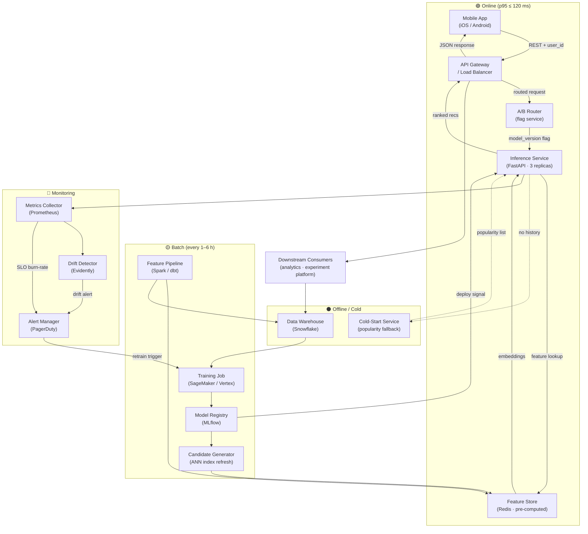

# MLOps Design Dossier — Scenario X: Personalized In-App Recommendations

## Executive Summary

This repository contains the complete MLOps design for a personalized product recommendation system serving a B2C mobile retail application. The system delivers ranked product recommendations on every home-screen load at 800 RPS peak with a 120 ms p95 end-to-end latency budget. User embeddings and candidate sets are pre-computed in batch (every 1–6 hours) and served from a Redis feature store, keeping the hot path to a lightweight re-ranking step only. Cold-start users (fewer than 3 browsing events in 30 days) are handled via a pre-materialized popularity fallback that respects the same latency SLO. A dedicated A/B router decouples experiment logic from model code, enabling continuous product experimentation without model redeployment. The feedback loop closes through Evidently-based drift detection and scheduled retraining, with MLflow managing model lineage and promotion gates.

---

## Architecture Diagram

---

## Key Numbers

| Metric | Value |
|---|---|
| Peak throughput | 800 RPS |
| p95 latency budget | 120 ms end-to-end |
| Availability SLO | 99.9% (43 min/month error budget) |
| Error rate SLO | < 0.5% of requests |
| Model re-rank candidates | ~200 items per request |
| Re-ranker model size | ~50 MB (ONNX / TorchScript) |
| Redis memory (user embeddings) | ~64 GB (128-dim float32 × 10 M users) |
| Inference service replicas | 3 × 4 vCPU / 8 GB RAM |
| Hardware choice | CPU-only inference (re-ranker is not GPU-bound at 200 candidates) |
| Monthly cost estimate | ~$1,200 (3× c6i.xlarge inference) + ~$800 (Redis Cluster r6g.2xlarge × 4) + ~$600 (SageMaker training, amortised) ≈ **$2,600 / month** |
| Feature freshness | ≤ 1 hour (batch cadence) |
| Batch pipeline cadence | Every 1–6 hours |

---

## Repository Navigation

| Directory | Primary artifact | What it contains |
|---|---|---|
| `architecture/` | [`architecture.md`](architecture/architecture.md) | System diagram, serving boundary explanation, feedback loop |
| `architecture/` | [`JUSTIFICATION.md`](architecture/JUSTIFICATION.md) | Pattern choices and trade-offs for all 8 key decisions |
| `architecture/adr/` | [`0001-precomputed-features.md`](architecture/adr/0001-precomputed-features.md) | ADR: pre-compute user embeddings into Redis vs. real-time feature computation |
| `architecture/adr/` | [`0002-blue-green-deploy.md`](architecture/adr/0002-blue-green-deploy.md) | ADR: blue/green rolling deploy strategy for model updates |
| `lifecycle/` | [`lifecycle.md`](lifecycle/lifecycle.md) | End-to-end ML lifecycle diagram (data → training → registry → serving → monitoring) |
| `lifecycle/` | [`model-registry.yaml`](lifecycle/model-registry.yaml) | Registry schema: promotion gates, lineage fields, approver policy |
| `container/` | [`Dockerfile`](container/Dockerfile) | Multi-stage build: builder + slim runtime, model baked in |
| `container/` | [`README.md`](container/README.md) | Image plan: base image rationale, bake-vs-mount decision, size estimate |
| `api/` | [`openapi.yaml`](api/openapi.yaml) | Full OpenAPI 3.1 spec: sync, batch, and async endpoints |
| `api/examples/` | [`recommend-request.json`](api/examples/recommend-request.json) · [`batch-request.json`](api/examples/batch-request.json) | Sample request/response payloads |
| `serving/` | [`capacity-plan.md`](serving/capacity-plan.md) | Replica math, latency budget breakdown, hardware sizing |
| `serving/` | [`slos.yaml`](serving/slos.yaml) | Measurable SLO objectives (latency, availability, error rate) |
| `serving/` | [`load-test-plan.md`](serving/load-test-plan.md) | k6 load test plan, ramp profile, pass/fail criteria |
| `cicd/` | [`.github/workflows/deploy-model.yml`](cicd/.github/workflows/deploy-model.yml) | Multi-stage CI/CD: lint → test → security scan → staging → production |
| `monitoring/` | [`alerts.yaml`](monitoring/alerts.yaml) | Burn-rate alerts, drift signal, model-version mismatch alert |
| `runbooks/` | [`rollback.md`](runbooks/rollback.md) | On-call rollback checklist with measurable trigger thresholds |

---

## Open Questions

1. **Redis Cluster failover RTO** — Redis Sentinel / Cluster mode automatic failover typically takes 15–30 seconds. If the on-call SLO requires sub-10-second recovery, we need to validate this with a chaos test before go-live and decide whether a local in-process fallback cache is warranted.

2. **A/B experiment sample size and ramp schedule** — The architecture assumes deterministic hash-based assignment, but the product team has not yet defined minimum detectable effect size or required experiment duration. This affects how quickly we can promote a challenger model and needs alignment before the first experiment launches.

3. **Data residency and PII handling for user embeddings stored in Redis** — User embeddings are derived from browsing and purchase history. Legal/compliance needs to confirm whether these embeddings constitute personal data under applicable regulations (GDPR, CCPA), which would affect Redis TTL policy, encryption-at-rest requirements, and the right-to-erasure deletion path.
