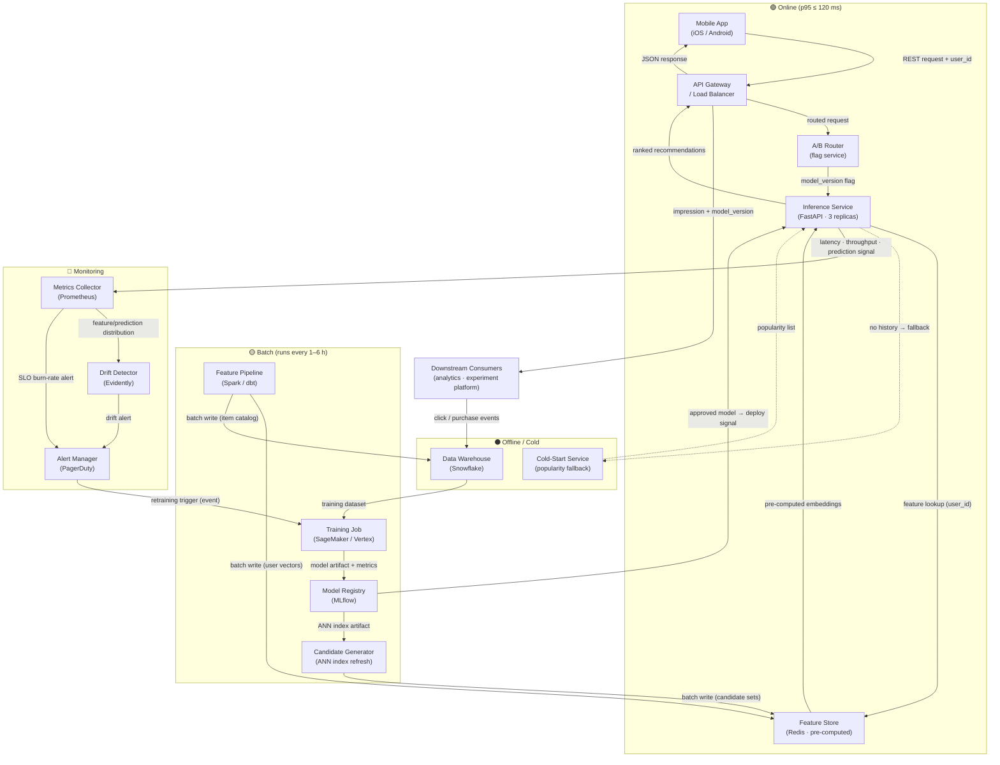

# Architecture — Scenario X: Personalized In-App Recommendations

## Executive Summary

A two-tier serving architecture for a B2C mobile retail app delivering personalized product
recommendations at 800 RPS peak. Online inference is served from a pre-computed feature store;
heavy lifting (candidate generation, embedding updates, A/B assignment) happens offline and
in batch. The feedback loop closes through a monitoring-driven retraining trigger.

---

## System Diagram



---

## Serving Boundary Explained

| Layer | Components | Latency budget |
|---|---|---|
| **Online** | API Gateway, A/B Router, Inference Service, Feature Store (Redis), Cold-Start fallback | ≤ 120 ms p95 end-to-end |
| **Batch** | Feature Pipeline, Training Job, Candidate Generator, Model Registry promotion | 1–6 h refresh cadence |
| **Offline** | Data Warehouse (historical events, training sets) | No latency constraint |

The inference service **never calls the DW at request time**. All user vectors and candidate sets
are pre-computed into Redis so that the hot path is purely: gateway → feature lookup → score → return.

---

## Feedback Loop

```
User interaction (click / purchase / skip)
        │
        ▼
Downstream Consumers → Data Warehouse          (event write, ~seconds lag)
        │
        ▼
Feature Pipeline                               (batch job, every 1 h)
        │
        ▼
Training Job triggered by:                     (schedule OR drift alert)
  • daily schedule
  • Drift Detector alert (distribution shift)
  • SLO burn-rate breach (latency or error rate)
        │
        ▼
Model Registry (evaluation gate, human sign-off for major bumps)
        │
        ▼
Inference Service (blue/green deploy, A/B traffic split)
        │
        ▼
Metrics Collector → Drift Detector (loop closes)
```

Monitoring output feeds retraining in two ways:

1. **Drift alert** — Evidently detects a shift in prediction score distribution or input feature
   distribution and emits an event to the Training Job queue.
2. **SLO burn-rate breach** — if error rate or latency degrades beyond the burn-rate threshold,
   the alert fires and a rollback is executed first; then a retraining is queued for the root cause.

---

## Cold-Start Handling

Users with fewer than 3 browsing events in the last 30 days are routed by the Inference Service
to the **Cold-Start Service**, which returns a popularity-ranked list scoped to the user's inferred
category (from app onboarding) or a global bestseller list. This path still respects the 120 ms
budget because the popularity list is also pre-materialized in Redis.

---

## A/B Testing Integration

The **A/B Router** reads a feature flag (LaunchDarkly or internal flag service) to assign each
`user_id` to a model variant. The `X-Model-Version` header is set on every response by the
Inference Service and forwarded to Downstream Consumers. The experiment platform joins impression
logs (with `model_version`) against purchase events to compute per-variant lift.

---

## Key Design Decisions

| Decision | Choice | Rationale |
|---|---|---|
| Pre-compute vs. real-time features | Pre-compute into Redis | Keeps hot path under 120 ms without a feature computation step |
| Model serving pattern | Embed scoring in service, not ANN-only | Allows personalized re-ranking on top of ANN candidates |
| Cold-start strategy | Popularity fallback (pre-materialized) | Zero additional latency, acceptable relevance for new users |
| A/B routing layer | Separate router before inference | Decouples experiment logic from model code |
| Retraining trigger | Dual: schedule + drift alert | Guarantees freshness floor while reacting to distribution shift |

Full trade-off rationale is in [`JUSTIFICATION.md`](./JUSTIFICATION.md) and ADRs
[`0001`](./adr/0001-precomputed-features.md) and [`0002`](./adr/0002-blue-green-deploy.md).
