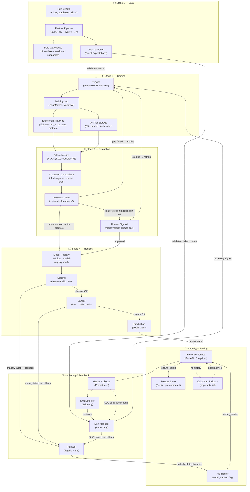

# ML Lifecycle — Scenario X: Personalized In-App Recommendations

## Overview

The lifecycle covers five stages: **Data → Training → Evaluation → Registry → Serving**, with a monitoring-driven feedback loop that closes back into training. Every stage has explicit entry gates, exit criteria, and responsible owners.

---

## End-to-End Lifecycle Diagram



---

## Stage Definitions

### Stage 1 — Data

| Step | Owner | Tool | Exit criterion |
|---|---|---|---|
| Event ingestion | Data Engineering | Kafka → Snowflake | Events land in DW within 5 min of occurrence |
| Feature pipeline run | ML Platform | Spark / dbt | Pipeline completes within 2× expected cadence; alert if overdue |
| Data validation | ML Platform | Great Expectations | Row count, null rate, schema, value range checks pass; fail → pipeline aborts and alerts |
| Snapshot versioning | ML Platform | DVC | Each training dataset tagged with `dataset_version` in MLflow run |

**Entry gate:** upstream Kafka topic is healthy, no schema-breaking change in last 24 h.
**Exit gate:** Great Expectations suite passes with 0 critical failures.

---

### Stage 2 — Training

| Step | Owner | Tool | Exit criterion |
|---|---|---|---|
| Trigger evaluation | ML Platform | Scheduler / Evidently alert | Either scheduled window reached OR drift PSI > 0.2 |
| Job submission | ML Platform | SageMaker / Vertex AI | Job starts within 10 min of trigger |
| Experiment logging | ML Engineer | MLflow | `run_id`, `dataset_version`, all hyperparameters, training metrics logged before job exits |
| Artifact storage | ML Platform | S3 (versioned bucket) | Model checkpoint + ONNX export + ANN index stored; SHA-256 recorded in MLflow |

**Entry gate:** validated dataset snapshot available in DW; no concurrent training run for same model family.
**Exit gate:** MLflow run in `FINISHED` state with all required fields populated (see `model-registry.yaml`).

**Retraining triggers:**

| Trigger | Source | Condition |
|---|---|---|
| Scheduled | Cron | Daily (off-peak, 02:00 UTC) |
| Drift alert | Evidently | Feature PSI > 0.2 OR prediction score KL divergence > 0.1 |
| SLO breach | Prometheus | Error rate > 1% sustained over 1 h burn-rate window |
| Manual | ML Engineer | On-demand via CI/CD pipeline dispatch |

---

### Stage 3 — Evaluation

| Check | Tool | Threshold | Action on failure |
|---|---|---|---|
| NDCG@10 vs. champion | Offline eval suite | Challenger ≥ champion − 1% | Archive challenger; re-trigger training |
| Precision@5 vs. champion | Offline eval suite | Challenger ≥ champion − 1% | Archive challenger; re-trigger training |
| Inference latency (p95) | Benchmark harness | < 40 ms on evaluation hardware | Archive; flag model size regression |
| Model size | CI check | ≤ 200 MB (ONNX) | Fail gate; engineer review required |
| Fairness check | Offline eval suite | No segment degrades > 5% vs. champion | Human review required before promotion |

**Minor version** (same architecture, fresh training data): automated gates only. No human required.
**Major version** (new architecture, new feature schema, new model family): automated gates + human sign-off from ML Lead within one business day.

The minor/major distinction is codified in `model-registry.yaml` under `version_policy`.

---

### Stage 4 — Registry

State machine for every model version:

```
CANDIDATE → STAGING → CANARY → PRODUCTION
                ↓         ↓
            ARCHIVED   ROLLED_BACK
```

| State | Traffic | Promotion condition | Demotion condition |
|---|---|---|---|
| `CANDIDATE` | 0% | Evaluation gates pass | Gate failure → `ARCHIVED` |
| `STAGING` | 0% (shadow logs only) | No errors in 100 shadow requests | Any error → `ROLLED_BACK` |
| `CANARY` | 5% → 25% | Error rate < 0.5%, p95 < 120 ms over 30 min | Threshold breach → `ROLLED_BACK` |
| `PRODUCTION` | 100% | — | SLO breach or manual rollback → `ROLLED_BACK` |
| `ARCHIVED` | 0% | — | Terminal state |
| `ROLLED_BACK` | 0% | Can be re-evaluated after fix | Terminal until re-submitted |

Full schema in [`model-registry.yaml`](./model-registry.yaml).

---

### Stage 5 — Serving

See [`architecture/architecture.md`](../architecture/architecture.md) for full serving diagram.

Key serving lifecycle events:

| Event | Action | Owner |
|---|---|---|
| Registry emits deploy signal | Rolling pod restart (blue/green per ADR-0002) | ML Platform / SRE |
| Redis batch write completes | New user vectors available for inference | ML Platform |
| A/B router flag updated | Traffic split shifts to new `model_version` | Product Engineering |
| Cold-start user detected | Route to popularity fallback, bypass inference | Inference Service (automatic) |

---

### Monitoring & Feedback Loop

| Signal | Source | Threshold | Action |
|---|---|---|---|
| Feature drift (PSI) | Evidently | > 0.2 | Queue retraining job |
| Prediction score drift (KL) | Evidently | > 0.1 | Queue retraining job |
| p95 latency burn-rate | Prometheus | 1 h fast-burn OR 6 h slow-burn breach | PagerDuty alert + rollback evaluation |
| Error rate burn-rate | Prometheus | 1 h fast-burn OR 6 h slow-burn breach | PagerDuty alert + rollback |
| Model version mismatch | Prometheus (`X-Model-Version` header) | Unexpected version in production | PagerDuty alert; investigate deploy state |
| Pipeline overdue | Airflow / scheduler | > 2× expected cadence | PagerDuty alert to Data Engineering |

Full alert definitions in [`monitoring/alerts.yaml`](../monitoring/alerts.yaml).
Rollback procedure in [`runbooks/rollback.md`](../runbooks/rollback.md).

---

## Lifecycle Ownership Matrix

| Stage | Primary Owner | Secondary Owner | Escalation |
|---|---|---|---|
| Data ingestion & validation | Data Engineering | ML Platform | Data Engineering Lead |
| Training & experiment tracking | ML Engineer | ML Platform | ML Lead |
| Evaluation & sign-off | ML Engineer | ML Lead (major versions) | ML Lead |
| Registry promotion | ML Platform | SRE | SRE Lead |
| Serving & infrastructure | SRE | ML Platform | SRE Lead |
| Monitoring & alerting | SRE | ML Engineer | On-call SRE |
| Rollback execution | On-call SRE | ML Engineer | SRE Lead |
